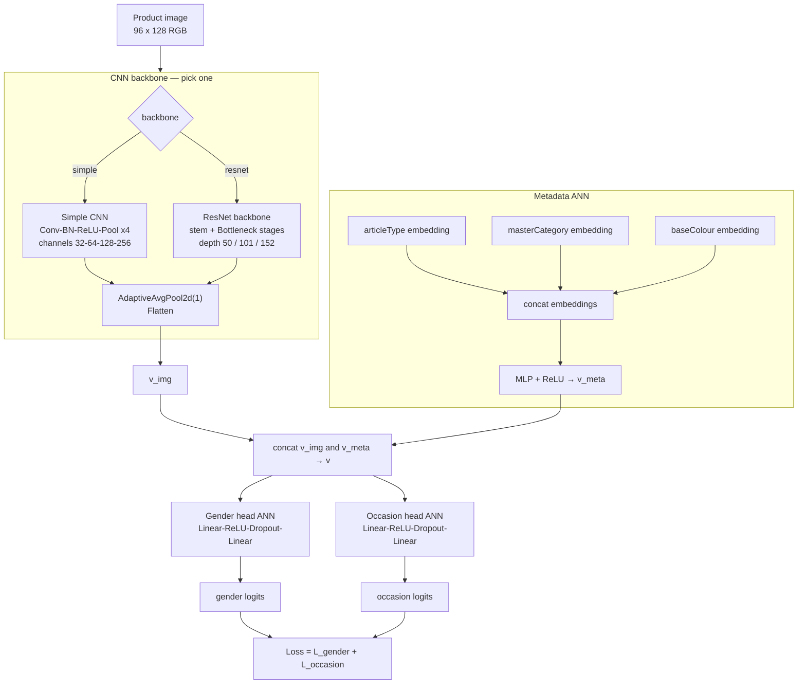
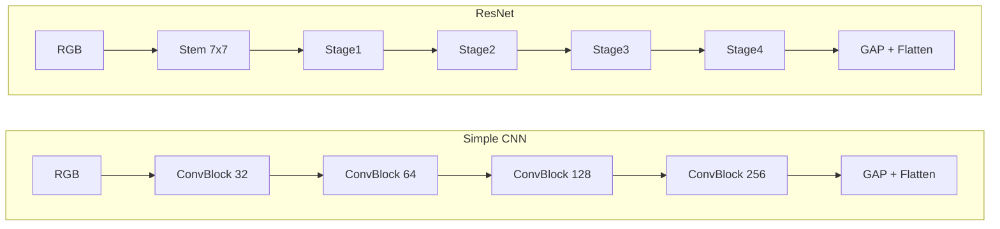

# Task 3: Gender and Occasion/Usage — Design Choice

## Objective

Predict two labels from each FashionDataset product image:

- **gender** — who the item is intended for (`Men`, `Women`, `Unisex`, `Boys`, `Girls`)
- **occasion** — what usage it suits (the CSV column `usage`: `Casual`, `Sports`, `Ethnic`, `Formal`, …)

The assignment allows either two prediction targets or one combined class. This note records the design chosen after `eda/task3_gender_usage_eda.ipynb` and `eda/metadata_eda.ipynb`.

## Chosen design

**One hybrid model, two heads** — not two separate models, and not a combined `gender | occasion` class.

The CNN backbone is swapped independently of the metadata branch and heads. Config `MODEL_PARAMS.backbone` is `"simple"` (default) or `"resnet"` (`depth` 50 / 101 / 152).



**Simple CNN** (lightweight baseline): four `Conv2d → BatchNorm → ReLU → MaxPool` stages, then global average pool and flatten. Output dim = last channel count (256 with the default `[32, 64, 128, 256]`).

**ResNet backbone** (deeper option): 7×7 stem, then Bottleneck stages. Output dim = 2048. Depth maps to block counts `[3,4,6,3]` (50), `[3,4,23,3]` (101), `[3,8,36,3]` (152).



Both backbones emit `v_img`. That vector is concatenated with `v_meta` from the metadata ANN, then **the same two heads** predict gender and occasion.

| Piece | Role |
|---|---|
| CNN backbone | `simple` or `resnet` — extract `v_img` from the product photo |
| Small ANN (metadata branch) | Embed `articleType`, `masterCategory`, `baseColour` → MLP → `v_meta` |
| Fusion | Concatenate `v_img` and `v_meta` |
| Head 1 | ANN softmax over gender |
| Head 2 | ANN softmax over occasion |

“Two heads” means **one network and two outputs**. The metadata ANN is a second **input branch**, not a second model. Switching simple CNN vs ResNet only changes how `v_img` is built.

## Why not a combined class

From `task3_gender_usage_eda.ipynb` (train, `n = 38,617`):

| Target | Classes | Notes |
|---|---:|---|
| `gender` | 5 | Men 54.2%, Women 36.7%, Unisex 5.4%, Boys 2.1%, Girls 1.7% |
| `occasion` (`usage`) | 9 including missing | Casual 76.8%, Sports 10.2%, Ethnic 6.7%, Formal 6.0%; `Home`/`Party`/`Travel`/`Smart Casual`/`Missing` are rare |
| Combined `gender \| occasion` | 27 observed (45 possible) | 15 classes have fewer than 50 images |

Cramer's V between `gender` and `occasion` is **0.207** (moderate). The labels are not independent, but one does not determine the other.

Notable couplings:

- Ethnic is ~96% Women.
- Formal is ~95% Men.
- Boys and Girls are almost entirely Casual.
- **Casual (~77% of the data) is mixed Men/Women**, so a joint tag is not a shortcut for the majority class.

A flat combined softmax would add a long tail (`Unisex | Home`, `Girls | Sports`, …) and 18 empty gender–occasion cells, while still leaving Casual as the dominant class. Separate heads keep evaluation interpretable (gender error vs occasion error) and avoid spending capacity on rare pairs.

## Why not two separate CNNs

Gender and occasion are read from the **same photo**. Metadata EDA shows both labels are associated with product taxonomy (`articleType`, `subCategory`, `masterCategory`), so they should share visual features (silhouette, garment type, styling).

Two independent CNNs would duplicate the encoder, double train/test cost, and ignore that shared structure. One encoder with two heads captures the moderate dependence (Cramer's V ≈ 0.21) without fusing the labels.

## Why a hybrid (image + metadata)

Metadata EDA Cramer's V of CSV fields against the two Task 3 targets:

| Metadata field | Cramer's V vs `gender` | Cramer's V vs `occasion` | Unique values | Role in hybrid |
|---|---:|---:|---:|---|
| `articleType` | 0.515 | 0.660 | 125 | **Use** — strongest safe signal |
| `subCategory` | 0.303 | 0.466 | 41 | **Do not use** — redundant with `articleType` (V ≈ 0.96) and `masterCategory` (V ≈ 1.00) |
| `masterCategory` | 0.175 | 0.434 | 7 | **Use** — cheap, coarse taxonomy for occasion |
| `baseColour` | 0.210 | 0.153 | 46 | **Use** — modest gender cue, low occasion cue |
| `year` | 0.180 | 0.137 | 12 | **Do not use** — weak vs both targets |
| `season` | 0.112 | 0.135 | 4 | **Do not use** — weakest vs both targets |

`articleType` is also the Task 1 target. It is the best single metadata predictor of both gender and occasion in the train table. `subCategory` is almost determined by `articleType` / `masterCategory`, so feeding all three as one-hot vectors repeats the same taxonomy at three granularities.

## Metadata columns used in the small ANN

**Included**

| Column | Encoding (suggested) | Why |
|---|---|---|
| `articleType` | Embedding (dim 16–32), not a 125-way one-hot | Strongest association with both heads |
| `masterCategory` | One-hot (7 levels) | Compact occasion signal; low cardinality |
| `baseColour` | Embedding (dim 8–16) or one-hot | Weak extra gender signal; keep if it helps validation, otherwise ablate |

**Excluded (do not train the metadata ANN on these)**

| Column | Reason |
|---|---|
| `gender` | **Target** — label leakage |
| `usage` / `occasion` | **Target** — label leakage |
| `id` | Identifier |
| `productDisplayName` | Near-unique text, not a categorical feature |
| `subCategory` | Redundant with `articleType` |
| `season`, `year` | Weak association with both targets |

Conceptual metadata branch:

```python
META_COLUMNS = ["articleType", "masterCategory", "baseColour"]

# articleType  → embedding → 16–32 dims
# masterCategory → one-hot → 7 dims
# baseColour → embedding → 8–16 dims
# concat → small MLP → v_meta  (e.g. 64 dims)
```

## Test-time metadata

`styles_prediction.csv` leaves `gender`, `articleType`, `season`, and `usage` empty. The hybrid branch therefore cannot read ground-truth CSV fields at test.

Use one of:

1. **Image-only fallback** — zero or drop `v_meta` at test (train with random metadata dropout so the CNN does not depend on it).
2. **Task 1 pipeline** — fill `articleType` with the Task 1 prediction, keep `masterCategory`/`baseColour` unknown (mask/zero). Task 1 errors will propagate into Task 3.

Do not assume the hidden test set provides `gender` or `usage` as inputs.

## Occasion label cleanup

Clean the **occasion head** independently of gender (same rule as Task 1 rare-class handling):

| Occasion | Train count | Action |
|---|---:|---|
| Casual, Sports, Ethnic, Formal | 29,641 / 3,940 / 2,570 / 2,300 | Keep |
| Missing, Smart Casual, Travel, Party, Home | 72 / 55 / 25 / 13 / 1 | Drop or merge to `Other` |

Gender has no class below 645 images; do not merge Boys/Girls unless a later experiment shows they are unstable.

## Image input

Reuse the Task 1 geometry decision: source photos are almost all **60 × 80**, so train with **96 × 128** (`height, width = 128, 96`) and pad rather than stretch. See `eda/analysis/task1_analysis.md`.

## Evaluation

Report **each head separately**:

- Gender: accuracy, macro-F1, per-class F1
- Occasion: accuracy, macro-F1, per-class F1 (Casual will dominate accuracy)

Macro-F1 on each head is the selection metric. Do not collapse the two heads into a single combined-class accuracy for model selection.

## Proposed ablations

Keep the CNN, split, seed, and budget fixed.

| Experiment | Inputs to fusion | Purpose |
|---|---|---|
| A | Image only (`v_img`) | Two-head baseline |
| B | Image + `articleType` | Strongest metadata only |
| C | Image + `articleType` + `masterCategory` + `baseColour` | **Selected hybrid** |
| D | Combined `gender \| occasion` class, image only | Confirm the joint-class design is worse |

Adopt C only if it improves **both** heads’ macro-F1 over A, and if the test protocol can supply `articleType` (ground truth or Task 1). If test metadata is unavailable, ship A.
