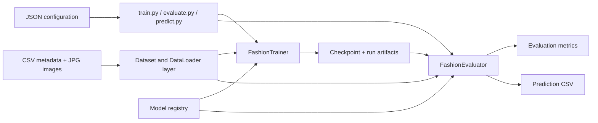
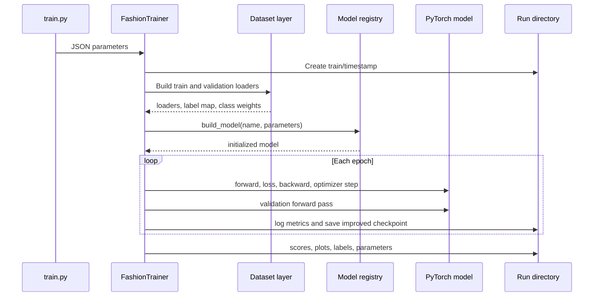

# Architecture and Data Flow

## System overview

Task 1 uses thin executable entry points, JSON configuration, reusable pipeline classes, and a registry of interchangeable CNN models. Training and evaluation share the same dataset splitting and deterministic validation transforms. Prediction restores preprocessing and label metadata from the checkpoint instead of duplicating those choices in its configuration.



## Module responsibilities

| Module | Responsibility |
| --- | --- |
| `train.py` | Loads `train_config.json`, creates `FashionTrainer`, and starts training. |
| `evaluate.py` | Loads `eval_config.json`, evaluates a checkpoint, and prints accuracy. |
| `predict.py` | Loads `predict_config.json` and runs test-image inference. |
| `src/trainer.py` | Coordinates data, model construction, optimization, validation, early stopping, and artifacts. |
| `src/evaluator.py` | Restores checkpoints and coordinates evaluation or prediction. |
| `src/custom_dataset.py` | Joins metadata to images, maps labels, computes class weights, and creates data loaders. |
| `src/transforms.py` | Implements OpenCV/NumPy preprocessing and augmentation as composable callables. |
| `src/models/model_zoo.py` | Maps configuration names to model classes through a central registry. |
| `src/metric_evaluation.py` | Computes aggregate and per-class classification metrics. |
| `src/utils.py` | Provides device selection, reproducible seeds, logging, early stopping, and plotting. |

## Training flow



The major stages are:

1. `SettingConfig` turns JSON keys into trainer attributes and chooses CUDA, MPS, or CPU.
2. A timestamped run directory is created and the raw configuration is saved.
3. `FashionDataset` loads metadata, removes unusable rows, optionally groups rare labels, creates a stable alphabetical label map, and computes inverse-frequency class weights.
4. `StratifiedShuffleSplit` creates training and validation indices using `SEED` and `VAL_RATIO`.
5. The model registry constructs the selected architecture and passes through `MODEL_PARAMS`.
6. The trainer uses cross-entropy loss, Adam, and `ReduceLROnPlateau` based on validation loss.
7. After every epoch, the configured `SAVE_BEST` metric determines whether `best_model.pth` is replaced. Early stopping monitors the same metric.
8. Final per-epoch scores and training curves are saved.

### Reproducibility boundary

Python, NumPy, and PyTorch random generators are seeded. The train/validation split is deterministic for a fixed dataset, seed, label column, validation ratio, and rare-class threshold. Full bit-for-bit reproducibility can still vary by device, PyTorch backend, parallel data loading, and nondeterministic hardware kernels.

## Data layer

### Training dataset

`FashionDataset(split="train")` reads `styles_train.csv`, resolves every `id` to `images_train/<id>.jpg`, and drops rows whose image is absent or whose target label is null.

Rare-class handling occurs before the label map is built:

```text
original label counts
        │
        ├── count >= MIN_CLASS_COUNT ──> keep original label
        └── count <  MIN_CLASS_COUNT ──> map to "Other"
```

When `MIN_CLASS_COUNT` is `0`, all original labels are retained. Class names are sorted alphabetically and mapped to zero-based indices. The mapping is stored both separately in `label_map.json` and inside the checkpoint.

Class weights use:

```text
weight(class i) = total samples / (number of classes × samples in class i)
```

These weights are passed to `CrossEntropyLoss` only when `USE_CLASS_WEIGHTS` is enabled.

### Split strategy

The training and validation dataset objects reference the same files but use different transform pipelines. One stratified split supplies indices to two `Subset` instances. Training batches are shuffled; validation batches are not.

The implementation groups singleton labels under a temporary synthetic label for the split calculation. This only affects stratification—the original mapped targets remain unchanged.

### Prediction dataset

`FashionDatasetTest` scans `TEST_IMAGE_DIR` for `.jpg` files, sorts their paths, and returns each transformed tensor with the filename stem as its ID. It does not require labels or CSV metadata.

## Image preprocessing

Both pipelines first convert OpenCV's BGR image to RGB. They then perform:

```text
Training:   pad to target aspect ratio → resize → optional augmentation → normalize → tensor
Val/Test:   pad to target aspect ratio → resize → normalize → tensor
```

Padding centers the entire product image on a constant-colour canvas before resizing, avoiding cropping or geometric stretching. Inputs use width 96 and height 128 by default. Normalization defaults to ImageNet channel means and standard deviations.

Training augmentation is opt-in. A horizontal flip is added only when `flip_p` exists in `TRANSFORM_PARAMS`; colour jitter is added when any of `brightness`, `contrast`, or `saturation` is present.

## Model zoo

All models accept RGB-like `in_channels`, the discovered `num_classes`, and architecture-specific keyword parameters.

| Model | Design | Intended use |
| --- | --- | --- |
| `light_cnn` | Depthwise-separable convolution blocks and a small dense head | Fast experiments and constrained hardware |
| `simple_cnn` | Conv–BatchNorm–ReLU–MaxPool stages | Straightforward baseline |
| `deep_cnn` | Two convolutions per stage before pooling | Higher-capacity custom CNN |
| `resnet_cnn` | Bottleneck residual stages with depths 50, 101, or 152 | Deep residual baseline |

All architectures end with adaptive average pooling, so they are not tied to a single spatial input resolution. The model registry in `model_zoo.py` provides a single construction interface for the trainer and evaluator.

To add another architecture:

1. Create an `nn.Module` in `src/models/`.
2. Accept `in_channels`, `num_classes`, and any model-specific keyword arguments.
3. Import the class and add a unique name to `REGISTRY` in `model_zoo.py`.
4. Select that name and its parameters in `config/train_config.json`.

## Checkpoint contract

`best_model.pth` is more than a weight file. It contains:

| Field | Used for |
| --- | --- |
| `state` | Model weights |
| `optimizer` | Optimizer state at the saved epoch |
| `epoch` and train/validation metrics | Training provenance |
| `num_classes` and `label_map` | Rebuilding and decoding the output layer |
| `model_name` and `model_params` | Reconstructing the exact architecture |
| `min_class_count` | Recreating validation label grouping |
| `transform_params` | Recreating validation and prediction preprocessing |

Evaluation still obtains `IN_CHANNELS` from its JSON configuration. Other model and preprocessing choices above are checkpoint-owned, reducing the chance that evaluation or prediction silently differs from training.

## Evaluation and prediction

Evaluation recreates the validation split, collects integer predictions and targets, and calculates:

- overall accuracy
- macro and weighted precision, recall, and F1
- precision, recall, F1, accuracy, and support for every class
- a scikit-learn classification report
- a confusion matrix

Prediction applies softmax to the logits, selects the maximum-probability class, maps its index back through the checkpoint label map, and writes the class name and rounded confidence to `predictions.csv`.

## Artifact layout

Every workflow uses `results/<phase>/<YYYYMMDD_HHMMSS>/`. Keeping the timestamped directory together is important: it connects the executable output with the exact parameters, metrics, logs, and checkpoint used for that run.
