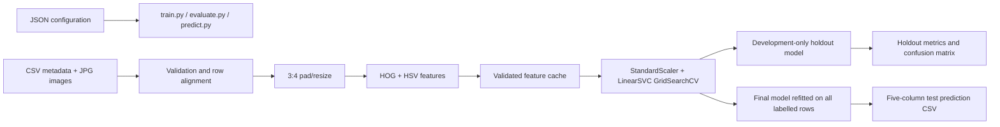
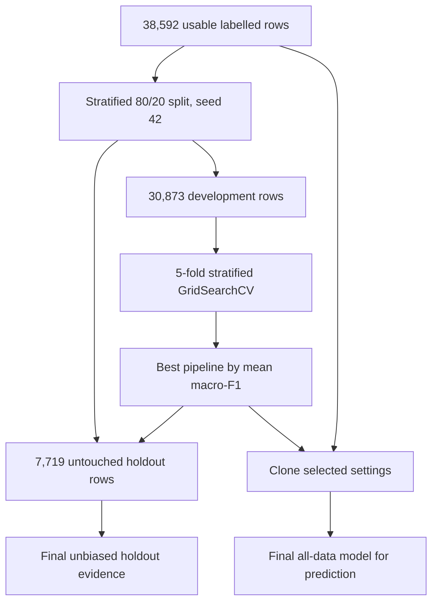

# Architecture and Evaluation Design

## System overview

## Module responsibilities

| Module | Responsibility |
| --- | --- |
| `train.py` | Loads `train_config.json` and starts the complete training investigation. |
| `evaluate.py` | Loads `eval_config.json` and reproduces holdout evaluation. |
| `predict.py` | Loads `predict_config.json` and generates test predictions. |
| `src/custom_dataset.py` | Validates CSV schemas, joins IDs to images, and removes unusable training rows. |
| `src/transforms.py` | Preserves aspect ratio, pads unusual images, resizes, and scales pixels. |
| `src/features.py` | Extracts HOG and HSV features and manages validated caches. |
| `src/models/` | Builds the `StandardScaler` and `LinearSVC` pipeline through a registry. |
| `src/trainer.py` | Coordinates the split, baseline, GridSearchCV, holdout evaluation, final refit, and artifacts. |
| `src/evaluator.py` | Re-evaluates the holdout model or predicts the supplied test set. |
| `src/metric_evaluation.py` | Computes and saves aggregate, balanced, and per-class evidence. |
| `src/utils.py` | Provides configuration, reproducibility, logging, JSON, and run-directory helpers. |

## Input and target boundary

The estimator receives only features derived from image pixels. Other training metadata is not supplied as input because Task 2 asks the system to determine season from the fashion image. The `season` column is used only as the supervised target.

Rows without `season` are excluded. Rows whose corresponding JPEG is absent are also excluded. The original CSV and image folders remain unchanged.

## Feature representation

Most supplied images are 60 × 80 pixels. The pipeline pads unusual aspect ratios and resizes to 48 × 64, retaining the dominant 3:4 ratio while lowering GridSearchCV memory use.

The feature vector has two parts:

1. HOG descriptors encode local edge direction and garment shape.
2. Normalized HSV channel histograms encode global colour information.

These are deterministic, non-learned representations. No pretrained model or external training data is used. The default settings produce 1,308 features per image.

## Cache validity

Each feature cache records the feature configuration, ordered image IDs, every image filename/size/modification time, and a SHA-256 fingerprint. It is reused only when its fingerprint and ordered IDs match the current dataset. This avoids silently pairing features with the wrong labels or test IDs.

## Evaluation protocol

The holdout never participates in scaling, SVM fitting, or hyperparameter selection. `StandardScaler` stays inside the pipeline and is fitted separately within every cross-validation fold.

The saved models have separate roles:

- `holdout_model.joblib` is fitted only on the development split and includes the exact holdout IDs.
- `season_model.joblib` uses the selected settings and is refitted on all usable labelled rows for final test prediction.

Evaluation refuses to use the all-data model for holdout metrics, preventing an accidental optimistic result.

## Metrics and ultimate judgement

Macro-F1 is the selection metric because Spring represents only about 4.1% of the usable data. Accuracy and weighted-F1 remain useful measures of overall performance but can be dominated by Summer. The workflow additionally records balanced accuracy, per-class precision/recall/F1, the full confusion matrix, fit time, prediction time, and model size.

The majority baseline supplies a minimum reference. The final judgement should compare the selected model with that baseline, inspect Spring recall and cross-season errors, and weigh performance against the compact model and CPU inference cost.

## Model bundle contract

Each saved bundle contains the fitted scikit-learn pipeline and the information required to apply it correctly: task and target names, expected labels, exact feature parameters and dataset fingerprint, model name and selected hyperparameters, cross-validation macro-F1, random seed and holdout ratio, training-data audit, and training scope.

The holdout bundle additionally stores the holdout IDs. The final bundle records the number of rows used for the all-data refit.

## Prediction contract

Prediction loads the supplied template in its original order, verifies one image per ID, calculates image features with the settings stored in the final model, and fills only `season`. It validates the column sequence, row count, ID order, missing values, and predicted class set before saving the CSV.
