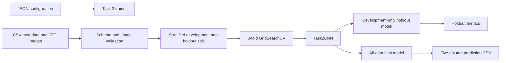
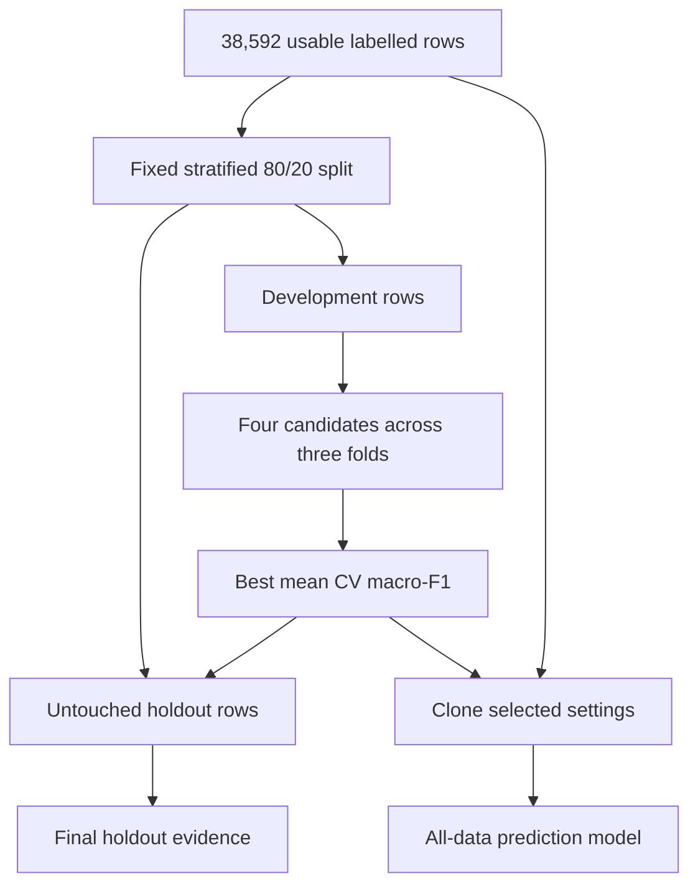

# Architecture and Evaluation Design

## System overview

## Task2CNN

The estimator loads image paths lazily, converts each image to RGB, preserves
its aspect ratio with padding, resizes it to 60 × 80, and scales pixels from
`[0, 1]` to `[-1, 1]`. The resulting `3 × 80 × 60` tensor passes through three
convolution, batch-normalization, ReLU, and max-pooling blocks. Fixed average
pooling feeds a 128-unit classification head and four output logits.

All weights use random Kaiming initialization and are learned from the supplied
FashionDataset. Training uses AdamW, class-aware cross-entropy, horizontal
flips, mild brightness and contrast changes, learning-rate reduction, dropout,
weight decay, and early stopping on internal-validation macro-F1.

`Task2CNNClassifier` implements scikit-learn's estimator interface. This allows
`GridSearchCV` to clone, fit, score, and select the PyTorch network. Fitted
models store CPU tensors so their `joblib` bundles can load on CUDA, MPS, or CPU.

## Evaluation boundary

Every cross-validation fit creates an internal stratified validation split for
early stopping. The holdout does not influence augmentation, weight learning,
early stopping, or parameter selection. The assignment test images are used
only after saving the all-data model.

The two saved bundles have separate roles:

- `holdout_model.joblib` contains the development-only model and exact holdout IDs.
- `season_model.joblib` contains a fresh fit on all usable labelled rows.

## Metrics and epoch curves

GridSearchCV selects macro-F1 because Spring represents only about 4.1% of the
usable data. Evaluation also records accuracy, weighted-F1, balanced accuracy,
per-class precision, recall and F1, and a confusion matrix.

The selected development model produces two figures: accuracy by epoch and
error by epoch, where error is `1 - accuracy`. Each contains training and
internal-validation curves, with the legend below the graph. No model-comparison
visualization is generated.

## Module responsibilities

| Module | Responsibility |
| --- | --- |
| `src/models/task2_cnn.py` | Defines Task2CNN, its training loop, probabilities, and scikit-learn wrapper. |
| `src/models/model_zoo.py` | Registers the single Task 2 estimator. |
| `src/custom_dataset.py` | Validates CSV schemas, IDs, labels, and matching images. |
| `src/transforms.py` | Preserves aspect ratio and produces RGB arrays. |
| `src/data_fingerprint.py` | Detects changes in image inputs and preprocessing settings. |
| `src/trainer.py` | Runs the split, GridSearchCV, holdout evaluation, refit, and saving. |
| `src/evaluator.py` | Reproduces holdout evaluation and creates test predictions. |
| `src/metric_evaluation.py` | Computes metrics and writes evaluation artifacts. |
| `src/visualization.py` | Produces the two Task2CNN epoch figures. |

## Saved-model contract

Each bundle stores the fitted model, target and expected classes, image geometry
and normalization, dataset fingerprint, selected parameters, CV macro-F1,
random seed, holdout ratio, dataset audit, and training scope. Evaluation stops
if the current training images no longer match the saved model.

The completed search selected `[32, 64, 128]` channels, dropout `0.25`, and
learning rate `0.001`. The development-only model achieved 0.7257 holdout
accuracy, 0.7249 macro-F1, and 0.7029 balanced accuracy.
