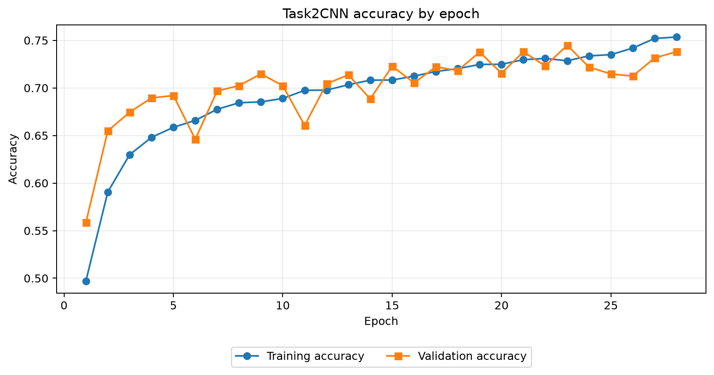
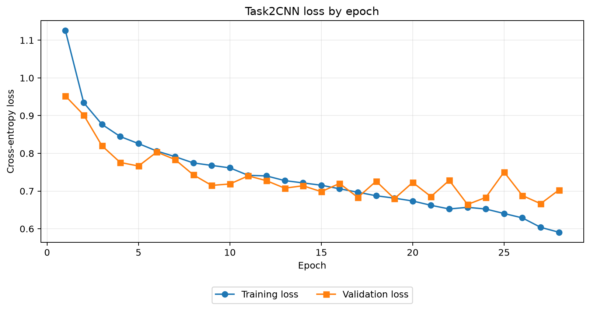

# Task 2 — Fashion Season Classification

## Data and preprocessing

Task 2 predicts Spring, Summer, Fall, or Winter from a fashion-product image.
The raw metadata contained 38,617 rows. Removing 20 rows without a season label
and five without a matching image left 38,592 usable examples. The classes are
imbalanced: Summer represents 49.583%, Fall 27.239%, Winter 19.121%, and Spring
only 4.058%. A majority baseline therefore reaches 49.58% accuracy but only
16.57% macro-F1 because it never recognises minority seasons.

The pipeline validates the CSV schema, identifiers, labels, and image paths.
Each image is converted to RGB, padded to preserve its aspect ratio, resized to
60 × 80, converted to a `3 × 80 × 60` tensor, and normalised to `[-1, 1]`.
Random horizontal flips and mild brightness and contrast changes are applied
only during training. Processing occurs in memory and does not modify the
FashionDataset. A stratified seed-42 split reserves 30,873 examples for
development and 7,719 for final holdout evaluation.

## Model configuration and selection

Task2CNN has three convolutional layers with 32, 64, and 128 channels. Each is
followed by batch normalisation, ReLU, and max pooling. Fixed average pooling
feeds a 128-unit dense layer and a four-unit output layer. The model has five
learnable weight layers and 339,876 parameters, all trained from scratch. It
uses AdamW, class-aware cross-entropy, batch size 128, weight decay 0.0001,
training augmentation, learning-rate reduction, dropout, and early stopping.

GridSearchCV provides a systematic and reproducible way to compare CNN channel
widths and dropout values through the model's scikit-learn-compatible wrapper.
Candidates are selected by macro-F1 because this metric gives equal importance
to every season despite the severe imbalance. The search selected channels
`[32, 64, 128]`, dropout `0.25`, and learning rate `0.001`, achieving mean CV
macro-F1 0.7155 and mean CV accuracy 0.7179.

Three-fold cross-validation balances reliability and computation. Four
candidates across three folds require 12 CNN fits, whereas five folds require
20 larger fits and approximately twice the total training work. Each
three-fold validation partition still contains about 10,291 images and
hundreds of Spring examples. The winning macro-F1 standard deviation was only
0.0075, indicating reasonably stable fold results. More folds could refine the
estimate but would not automatically improve the final model.

## Training behaviour

Each fit uses an internal 10% validation split and stops after five epochs
without sufficient validation macro-F1 improvement. The selected development
fit ran for 28 epochs and restored epoch 23, where validation accuracy was
0.7448, macro-F1 was 0.7420, and loss was 0.6645. The curves show training
performance continuing to improve while validation performance becomes less
stable, supporting early stopping instead of simply increasing the epoch
limit.

*Figure 1. Training and internal-validation accuracy.*

*Figure 2. Training and internal-validation cross-entropy loss.*

## Evaluation, prediction, and limitations

On the untouched holdout, Task2CNN achieved 72.57% accuracy, 72.49% macro-F1,
72.50% weighted-F1, and 70.29% balanced accuracy. Class F1 scores were 0.7628
for Spring, 0.7603 for Summer, 0.6638 for Fall, and 0.7127 for Winter. Similar
accuracy and macro-F1 indicate that performance is not obtained only by
favouring Summer.

Accuracy remains below 80% because season is not always visually identifiable;
it can describe a release or merchandising period. Visually similar products
can have different season labels, and the dataset combines clothing, footwear,
accessories, cosmetics, and other categories. Spring also has few examples.
The image-only model cannot use product names, article types, colour metadata,
or release information, and assignment constraints require training from
scratch. The learning curves show that extra epochs alone would risk
overfitting rather than guarantee higher accuracy.

After evaluation, the selected configuration was refitted on all 38,592 usable
examples. It generated 5,829 test predictions with the required five-column
schema: Summer 3,055, Spring 1,256, Winter 1,239, and Fall 279. These counts are
diagnostic because the test labels are unavailable. Overall, Task2CNN is a
reproducible and class-aware solution that substantially exceeds the majority
baseline, although its 72.57% holdout accuracy does not reach the desired 80%.
