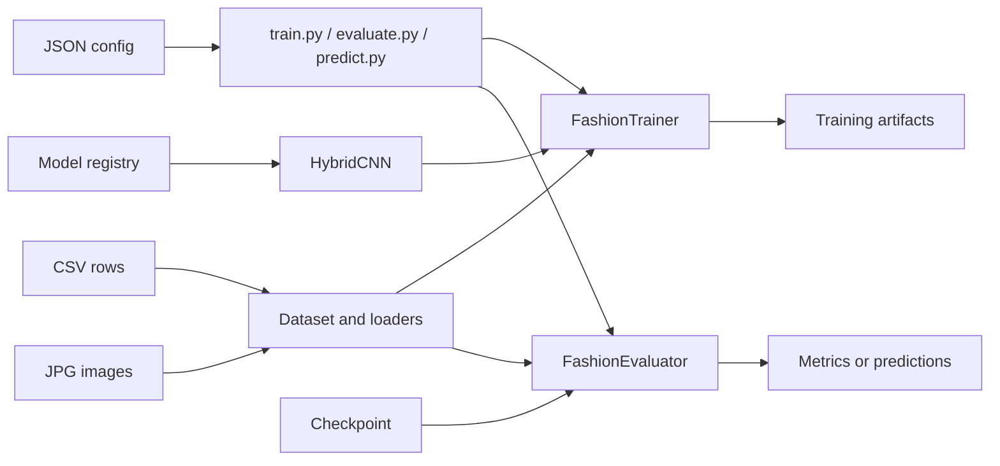
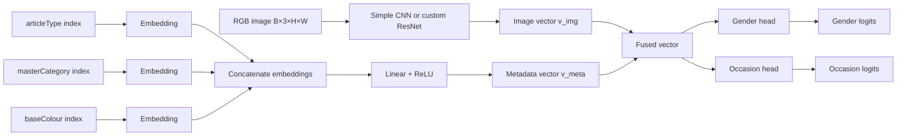
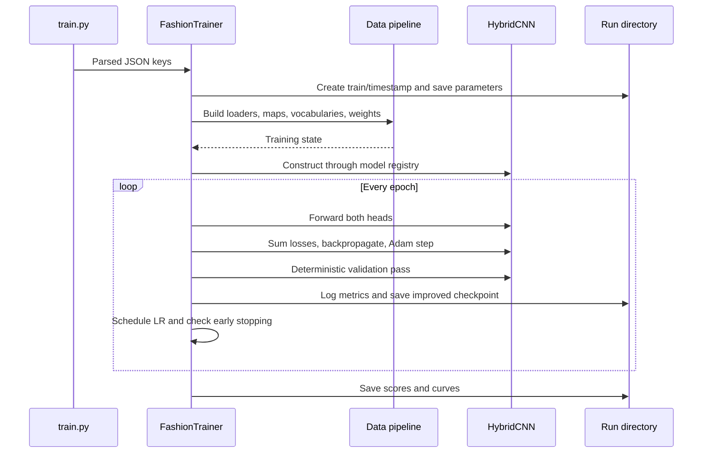

# Architecture

## System overview

Task 3 separates its executable entry points, configuration, data pipeline, model construction, workflow orchestration, and output artifacts.



## Module responsibilities

| Module | Responsibility |
| --- | --- |
| `train.py` | Loads `train_config.json` and starts `FashionTrainer`. |
| `evaluate.py` | Loads `eval_config.json` and evaluates the validation split. |
| `predict.py` | Loads `predict_config.json` and runs test inference. |
| `src/trainer.py` | Coordinates data loading, optimization, validation, scheduling, stopping, and artifacts. |
| `src/evaluator.py` | Reconstructs a checkpointed model and coordinates evaluation or prediction. |
| `src/custom_dataset.py` | Joins CSV rows with images, encodes labels and metadata, creates the split and loaders. |
| `src/transforms.py` | Implements composable OpenCV/NumPy preprocessing and augmentation. |
| `src/models/hybrid_cnn.py` | Defines both image backbones, metadata fusion, and output heads. |
| `src/models/model_zoo.py` | Provides a registry-backed `build_model` interface. |
| `src/metric_evaluation.py` | Computes overall, averaged, and per-class metrics. |
| `src/utils.py` | Supplies device selection, seeds, logging, early stopping, run directories, and plots. |

## Data pipeline

### Filtering and encoding

`FashionDataset(split="train")` reads `styles_train.csv` and maps every `id` to `images_train/<id>.jpg`. It then:

1. Removes rows without an existing image.
2. Removes rows missing `gender` or `usage`.
3. Removes each `usage` class with fewer than `MIN_OCCASION_COUNT` samples.
4. Sorts the remaining class names and assigns zero-based gender and occasion indices.
5. Builds sorted vocabularies for `articleType`, `masterCategory`, and `baseColour`.
6. Reserves metadata index `0` for `<unk>`, missing, or unseen values.

Unlike grouping strategies that create an `Other` class, rare occasions are discarded entirely in this implementation.

Class weights for either head are computed as:

```text
weight(class i) = number of retained samples
                  / (number of classes × retained samples in class i)
```

### Train/validation split

Each row receives a combined stratification label:

```text
combined = gender_index × number_of_occasion_classes + occasion_index
```

`StratifiedShuffleSplit` uses that combined label so both targets are represented jointly. Combined groups containing fewer than two samples are temporarily merged for split calculation; their actual training targets do not change. The same indices select from two dataset objects: one has stochastic training transforms, while the other has deterministic validation transforms.

Evaluation calls the same loader factory. With identical data, `SEED`, `VAL_RATIO`, and checkpoint-restored occasion filtering, it recreates the training run's validation subset.

### Image preprocessing

OpenCV reads an image in BGR order, after which the dataset converts it to RGB. Processing then follows:

```text
Training:   pad to target aspect ratio → resize → optional flip/jitter
            → normalize → HWC-to-CHW tensor

Val/Test:   pad to target aspect ratio → resize
            → normalize → HWC-to-CHW tensor
```

Padding centers the complete image on a constant-colour canvas. This achieves the configured aspect ratio before resize without cropping or stretching the product itself. Normalization defaults to ImageNet channel means and standard deviations.

## Hybrid neural network

The network processes one image tensor and three categorical indices per sample.



### Image branch

The `simple` backbone repeats Conv2d → BatchNorm → ReLU → MaxPool for every value in `channels`, then applies adaptive average pooling and flattening. Its output width is the final channel count.

The `resnet` backbone is implemented locally rather than imported with pretrained weights. It uses a 7×7 stem followed by four bottleneck stages and adaptive average pooling. Supported depths and stage layouts are:

| Depth | Bottleneck blocks by stage | Image vector width |
| --- | --- | --- |
| 50 | `[3, 4, 6, 3]` | 2048 |
| 101 | `[3, 4, 23, 3]` | 2048 |
| 152 | `[3, 8, 36, 3]` | 2048 |

Convolutional and linear layers receive Kaiming initialization; batch normalization scales start at one with zero bias.

### Metadata branch

Each metadata field has an independent embedding table whose padding index is `0`. The three embeddings are concatenated and projected through Linear → ReLU into a `meta_dim` vector.

During training, a Bernoulli mask zeros the entire metadata vector for each sample with probability `meta_dropout_p`. This teaches the downstream heads to remain useful when test metadata is unavailable. During validation and prediction the dropout is disabled; missing metadata still maps to the learned padding/unknown embeddings before the metadata MLP.

### Fusion and output heads

The image and metadata vectors are concatenated. Two independent heads each apply Linear → ReLU → Dropout → Linear, producing unnormalized logits for their own class space.

The training objective is equally weighted:

```text
total loss = CrossEntropy(gender logits, gender target)
           + CrossEntropy(occasion logits, occasion target)
```

When `USE_CLASS_WEIGHTS` is enabled, each head receives its own inverse-frequency weight vector.

## Training lifecycle



`ReduceLROnPlateau` always observes validation loss. Checkpoint selection and early stopping observe `SAVE_BEST`; accuracy metrics use maximum mode and loss metrics use minimum mode.

## Checkpoint contract

`best_model.pth` stores:

| Field group | Purpose |
| --- | --- |
| `state` | Model parameter tensors. |
| `optimizer` | Adam state at the selected epoch. |
| `epoch`, losses, accuracies | Saved-epoch provenance. |
| class counts and both label maps | Reconstructs and decodes the two output heads. |
| `meta_vocabs` | Reconstructs embedding sizes and encodes prediction metadata. |
| `model_name`, `model_params` | Recreates the exact network topology. |
| `min_occasion_count` | Recreates training-row filtering during evaluation. |
| `transform_params` | Recreates validation and inference preprocessing. |

Evaluation and prediction still obtain `IN_CHANNELS` from their JSON configuration. The remaining architecture and preprocessing state is checkpoint-owned.

## Evaluation and prediction

Evaluation gathers predictions independently for both heads. It calculates overall accuracy, macro and weighted precision/recall/F1, per-class metrics and support, a classification report, and a confusion matrix.

Prediction applies softmax independently to each head, selects each maximum-probability class, decodes it through the saved label map, and writes both labels and confidences to one CSV row.

## Reproducibility boundary

The pipeline seeds Python, NumPy, and PyTorch during training, and the data split has its own fixed random state. A fixed dataset and configuration therefore reproduce the same split. Exact numerical reproducibility can still vary across PyTorch versions, CPU/CUDA/MPS backends, data-loader scheduling, and nondeterministic hardware kernels.
